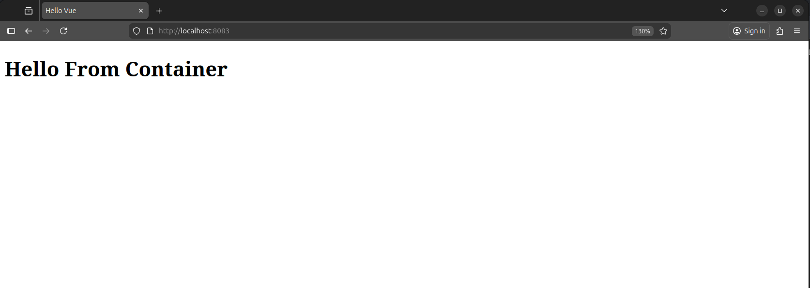

# Containerizing a Vue.js Application with Vite

This project demonstrates how to containerize a simple Vue.js application built with Vite.
The container is configured to serve the app on port 8083 and allows access from any network interface,
making it suitable for development and testing in Docker environments.

---

## Diagram


---

## Change Vit configuration

- Configure Vite to listen on all interfaces (0.0.0.0) and use port 8083,
  so the app can be accessed from outside the container.

```bash
CMD ["npm", "run", "dev", "---", "--host", "0.0.0.0", "--port", "8083"]
```

---

## Steps to Run Locally

- clone the project into your laptop

```bash
git clone https://github.com/OmdaMukhtar/vuecontainer.git && cd vuecontainer
```

- build the image

```bash
docker build -t omda/vueapp:latest . --no-cache
```

- run the container image

```bash
docker run -d -p 8083:8083 --name mycontainer omda/vueapp:latest
```

## Feature Enhancement

- Use multi-stage Docker builds to speed up builds and produce smaller, optimized images.

---

## Screenshot


